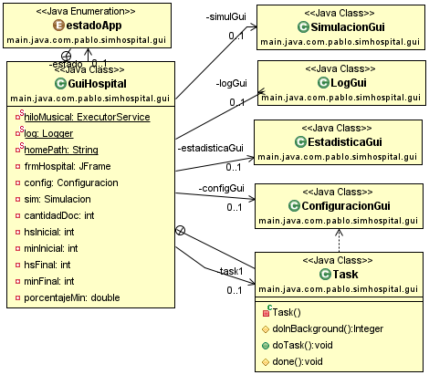
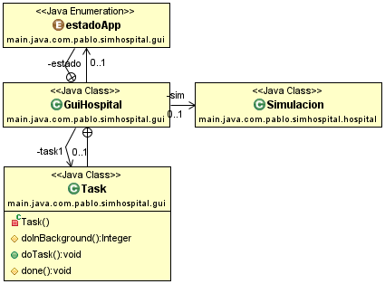
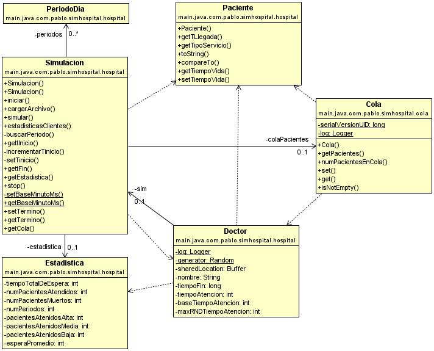

#Diagramas de clases
___
###Diagrama de clases de las pantallas de la aplicacion
***GuiHospital instancia las pantallas, agrega los listener a los botones y se encarga de interactuar en background con la simulacion propiamente dicha.***

____
***GuiHospital instancia una clase Simulación y una SwingWorkerTask, que recibe una referencia de la simulacion y en las condiciones apropiadas ejecuta el método simular de dicha clase***

____
***La simulación tiene una _cola con prioridad_  de pacientes que implementa una interfaz buffer para poder realizar la sincronización, ya que cada Doctor es un Hilo que "consume" pacientes***

